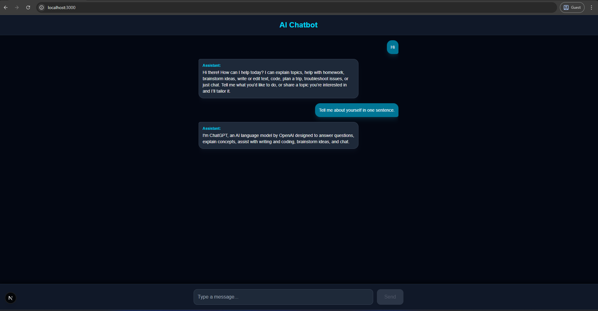

# AI Chatbot with OpenAI, LangChain, and Next.js

[](https://nextjs.org/) 
[](https://openai.com/) 
[](https://www.langchain.com/)

A step-by-step example of building an **AI-powered chatbot** using **OpenAI GPT models**, orchestrated with **LangChain**, and deployed in a **Next.js** application.

---

## Project Preview



---

## Tech Stack

- [Next.js](https://nextjs.org/)  
- [Node.js](https://nodejs.org/)  
- [LangChain](https://www.langchain.com/)  
- [OpenAI GPT](https://openai.com/)

---

## Getting Started

### Prerequisites

- Node.js 18+  
- OpenAI API key  

### Installation

```bash
# Create Next.js project (if starting fresh)
npx create-next-app@latest ai-chatbot
cd ai-chatbot

# Install dependencies
npm install langchain openai

## Run the development server:
npm run dev
# or
yarn dev
# or
pnpm dev
# or
bun dev
```

